<h3><code>you@github ~ $ ./contributions.sh --game snake</code></h3>

<picture>
  <source media="(prefers-color-scheme: dark)" srcset="https://raw.githubusercontent.com/Ansika-Singh/Ansika-Singh/output/snake-dark.svg" />
  <source media="(prefers-color-scheme: light)" srcset="https://raw.githubusercontent.com/Ansika-Singh/Ansika-Singh/output/snake.svg" />
  
</picture>

  

<h3><code>you@github ~ $ whoami</code></h3>
<table>
  <tr>
    <td valign="top"></td>
    <td valign="top"></td>
  </tr>
</table>

